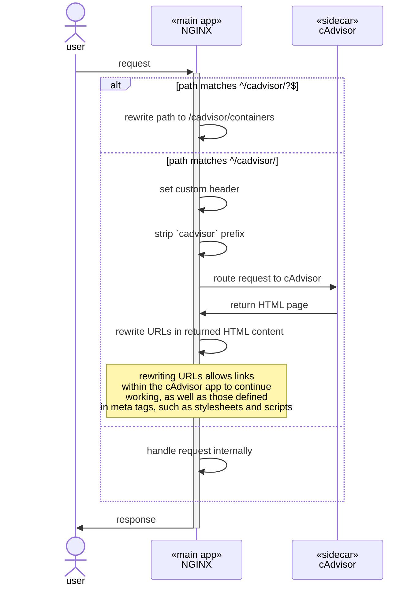

## TOPZ exercise: Solution 01 (use cAdvisor in place of TOPZ)
### Summary
This solution applies Nova's suggestion of replacing the `topz` sidecar (not compatible with either Mac OS or with the Mac Silicon hardware) with an alternate sidecar. It uses NGINX as the "main application", assuming some static content is being served, and `cAdvisor` as the sidecar.

### Solution Artifacts
The solution is implemented as
- an [nginx-conf][nginx.conf] file that contains the service configuration
- a [docker-compose][docker-compose] file that contains the docker network and container information

#### Running the solution
Navigate to this folder in your clone of this repository
Run the following command to start the solution implementation (will run on port :8080)
```
docker-compose up -d
```

#### Observe the solution
* point your browser to `localhost:8080` to see the default NGINX welcome page... this is a stand-in for the "main application"
* point your browser to `localhost:8080/cadvisor` or `localhost:8080/cadvisor/containers` to see the UI of the cadvisor sidecar
* Navigate the cadvisor page to be sure the links work, and external resources are loading (you should see graphs, gauges, _etc._)

#### Stopping the solution
Navigate to this folder in your clone of this repository
Run the following command:
```
docker-compose down
```

### Solution 01 -- Solution Design
<details>
<summary>Solution design diagram</summary>


</details>

### Comments
This turned out to be as much or more an exercise in learning NGINX as a lesson in the sidecar pattern, but I seem to have gotten there in the end.

I've gone through several iterations, with only the final iteration captured here. The first iteration exposed all of the cAdvisor paths as top-level paths, just below the root, (_e.g._, /containers, /docker, _etc._). It occurred to me to apply the sidecar as a general pattern, it was probably wiser to use a less-ambiguous path (some hypthetical 'main application' might conceivably require a `containers` path at the root), and to only occupy one namespace for the cadvisor paths, so the second solution takes that approach, using `sub_filter` directives to rewrite URLs in the HTML returned from the downstream cAdvisor service, so that all urls meant to redirect to the sidecar have paths prefixed with `/cadvisor`.

A good deal of this work was also teasing out which suggestions of the AI were valuable and which were not. For example, when I had some links that were not working correctly, the AI suggested rewriting all relative paths, which ended up having disastrous consequences for loading non-html resources like stylesheets and scripts, and proved unnecessary anyway. Another dubious AI suggestion was using `$host:$server_port` to force re-written URLs to have the correct port address. It turns out the correct solution was to use the `$http_host` variable, but the AI continued to suggest the other usage.

Taking a step back to more general observations, I find that the AI (in this case ChatGPT 4o) does pretty well with general purpose languages like JavaScript, but falters a bit with purpose-built languages like the configuration language in NGINX or other DSLs. Not sure if that observation will hold up to scrutiny over time. But I will keep it in mind.

### Challenges
#### Path and Port Rewriting:
    * Managed cAdvisor’s links and assets that initially lacked correct paths and port information, leading to broken links and missing resources.

#### Handling Trailing Slashes and Redirects:
    * Configured Nginx to append trailing slashes on specific routes (top-level routes) that otherwise report a 404. Note that for routes below the top level (_e.g._, `/containers/docker`), _including_ the trailing slash is an error
    * Addressed issues where URLs were incorrectly rewritten, causing multiple redirects or incorrect paths.

#### Caching and Profile-Specific Issues:
    * Resolved persistent caching issues where browser profiles retained outdated URL mappings, leading to debugging obstacles.

#### Optimizing Resource Buffering:
    * Increased Nginx buffer sizes and disabled disk buffering to handle the larger upstream data from cAdvisor, which required handling more data-intensive API responses. This was largely a developer-experience issue, as I like to view log output in [`lnav`](https://lnav.org/ "The LogFile Navigator | command-line log viewer) and the warnings announcing exceeding buffer sizes were disrupting the lnav display output.

<!-- NAMED LINKS -->
[nginx-conf]: ./nginx.conf "nginx.conf (NGINX configuration file for proxying requests to main app or cadvisor sidecar)"

[docker-compose]: ./docker-compose.yaml "docker-compose.yaml | contains docker network and container setup"