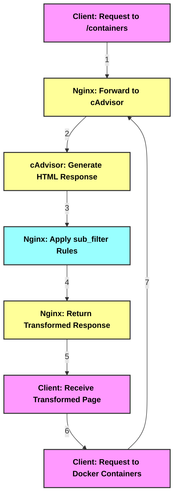

## Sidecar Hands-on Exercise #1: TOPZ
This exercise has the reader starting an arbitrary application container that exposes some HTTP API, and runs a sidecar container in the same namespace which provides an additional `/topz` endpoint which provides resource usage data for the container host.

<details>
<summary>Exercise definition</summary>

* Step1
```shell
docker run -d <my-app-image>
<container-hash-value>
```

* Step 2
```shell
docker run --pid container:${APP_ID} \
    -p 8080:8080 \
    brendanburns/topz:db0fa58 \
    /server --addr-0.0.0.0:8080
```
</details>

## Setup
I'm using the default installation of Rancher Desktop (v1.16.0) on Apple M1 Silicon, along with the provided `dockerd` container engine

I will do my best to translate the command-line inputs suggested by the book into Dockerfiles (with the aid of my AI assistant) that I can store in this repository

## Challenges
1. The author doesn't provide the main application for the exercise
    > In the absence of having a specific application to run, on the advice of my code-assistant AI, I've opted to use a standard NGINX container as my base application. This gives me some default behavior

2. The provided image expects a `Linux/AMD64` architecture.
    > My code assistant AI has suggested two alternatives:
    > 1. use an alternate sidecar application (cAdvisor)
    > 2. Build a Multi-Arch Image of Topz
    > Since this is all practice, I will try both approaches

---
## Trials
### Trial 1: Run alternate `cAdvisor` sidecar
#### Challenges
NGINX container keeps exiting:
<details>
<summary>log output</summary>

```log
/docker-entrypoint.sh: /docker-entrypoint.d/ is not empty, will attempt to perform configuration
/docker-entrypoint.sh: Looking for shell scripts in /docker-entrypoint.d/
/docker-entrypoint.sh: Launching /docker-entrypoint.d/10-listen-on-ipv6-by-default.sh
10-listen-on-ipv6-by-default.sh: info: Getting the checksum of /etc/nginx/conf.d/default.conf
10-listen-on-ipv6-by-default.sh: info: /etc/nginx/conf.d/default.conf differs from the packaged version
/docker-entrypoint.sh: Sourcing /docker-entrypoint.d/15-local-resolvers.envsh
/docker-entrypoint.sh: Launching /docker-entrypoint.d/20-envsubst-on-templates.sh
/docker-entrypoint.sh: Launching /docker-entrypoint.d/30-tune-worker-processes.sh
/docker-entrypoint.sh: Configuration complete; ready for start up
2024/10/24 05:49:07 [emerg] 1#1: host not found in upstream "cadvisor" in /etc/nginx/conf.d/default.conf:12
nginx: [emerg] host not found in upstream "cadvisor" in /etc/nginx/conf.d/default.conf:12
/docker-entrypoint.sh: /docker-entrypoint.d/ is not empty, will attempt to perform configuration
/docker-entrypoint.sh: Looking for shell scripts in /docker-entrypoint.d/
/docker-entrypoint.sh: Launching /docker-entrypoint.d/10-listen-on-ipv6-by-default.sh
10-listen-on-ipv6-by-default.sh: info: Getting the checksum of /etc/nginx/conf.d/default.conf
10-listen-on-ipv6-by-default.sh: info: /etc/nginx/conf.d/default.conf differs from the packaged version
/docker-entrypoint.sh: Sourcing /docker-entrypoint.d/15-local-resolvers.envsh
/docker-entrypoint.sh: Launching /docker-entrypoint.d/20-envsubst-on-templates.sh
/docker-entrypoint.sh: Launching /docker-entrypoint.d/30-tune-worker-processes.sh
/docker-entrypoint.sh: Configuration complete; ready for start up
2024/10/24 05:50:15 [emerg] 1#1: host not found in upstream "cadvisor" in /etc/nginx/conf.d/default.conf:12
nginx: [emerg] host not found in upstream "cadvisor" in /etc/nginx/conf.d/default.conf:12
```
</details>

solution (from Nova): create and use a Docker network



